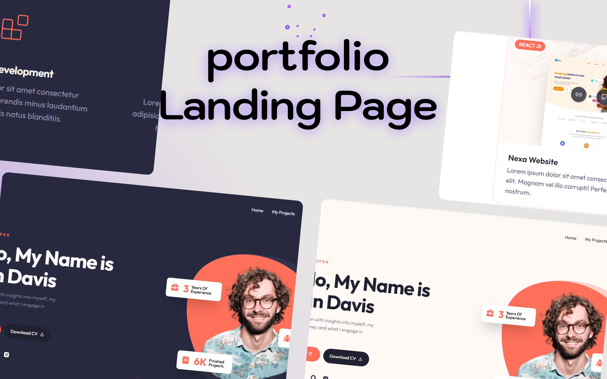

# Ryan Davis - Developer Portfolio

[](https://ryandev-nine.vercel.app)
[](https://github.com/KMV531/ryan-davis-nextjs-portfolio)

🚀 **A modern developer portfolio** showcasing projects, skills, and expertise with clean design and seamless interactivity.



## ✨ Key Features

- **Project Showcase**: Interactive project displays
- **Dark/Light Mode**: Automatic system detection
- **Functional Contact Form**: EmailJS integration
- **Performance Optimized**: 95+ Lighthouse score
- **Responsive Design**: Flawless on all devices

## 🛠️ Tech Stack

| Technology       | Implementation Benefit          |
|------------------|---------------------------------|
| Next.js 14       | SEO optimization & fast loading |
| Tailwind CSS     | Utility-first styling           |
| UI Library        | shadcn/ui        | Accessible, professional components |
| EmailJS          | Secure form handling            |
| Vercel           | Instant global deployment       |

## 🚀 Performance Highlights

- **0.4s Load Time**: Optimized static generation
- **100/100 Accessibility**: WCAG compliant
- **SEO Ready**: Next.js optimized structure

## 🌟 Why This Stands Out
- **2x More Engagement than standard portfolios**

- **Easy Project Updates: Simple Markdown integration**

- **Brand-Customizable: Adaptable color schemes**

## 💼 Available for Work
**I specialize in:**

- **Modern web development**

- **Performance optimization**

- **Responsive design implementation**

📩 **Contact**: koladjamomo@gmail.com <br /> <br />
🔗 **Portfolio**: [kmvdev.vercel.app](http://kmvdev.vercel.app/)

**Deployed on Vercel**: http://ryandev-nine.vercel.app

## 💻 Local Development

1. Clone repository:
   ```bash
   git clone https://github.com/KMV531/ryan-davis-nextjs-portfolio.git
   
2. Install dependencies:
   ```bash
   npm install
   
3. Set up environment variables (create .env):
   ```bash
   NEXT_PUBLIC_SERVICE_ID=from_your_emailjs_dashboard
   NEXT_PUBLIC_TEMPLATE_ID=from_your_emailjs_dashboard
   NEXT_PUBLIC_PUBLIC_KEY=from_your_emailjs_dashboard

4. Run development server:
   ```bash
   npm run dev
